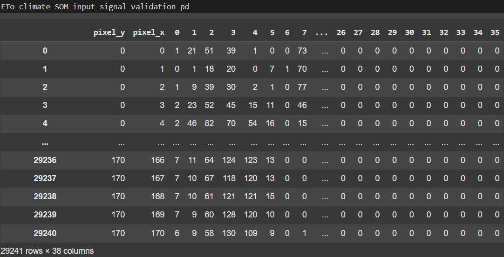
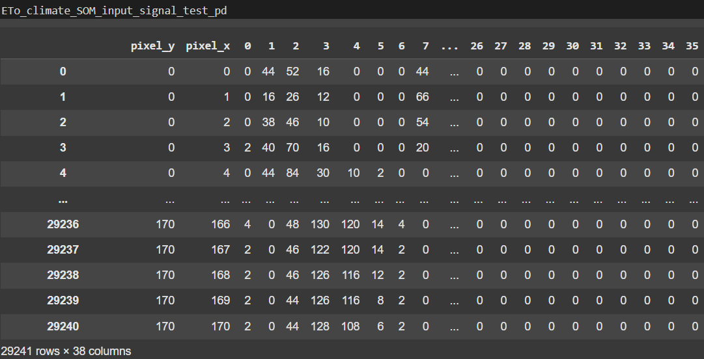

# ETo Climate Clustering  

---

## 1. GENERAL REQUIREMENTS

* Linux operating system.
* WRF system.
* HPC (optional).
* Python.
* Google Drive.
* Google Colab TPU.
* Google Colab High RAM CPU.

---

## 2. WRF 

The WRF system must be downloaded and installed on a Linux distribution in a local machine or an HPC. For this project, **Linux Mint MATE** was chosen as the operating system in te local machine and **Ubuntu Server** for the HPC. This repository provides detailed instructions for configuring and processing data using the Weather Research and Forecasting (WRF) model. The workflow is designed for a specific geographical domain, enabling the processing of meteorological variables and the generation of outputs for advanced analysis. Executing this study for other domains requires prior modification and configuration of the code provided in this repository.

Disclaimer: The configuration and code in this repository are intended for research purposes only. Users are responsible for adapting the workflow to their specific needs and ensuring compliance with applicable regulations and licensing agreements for the software and data used.

### 2.1. WRF system prerequisites  
Ensure the following libraries and packages are installed on your operating system:  

* `csh`  
* `gcc`  
* `gfortran`  
* `libpng-dev`  
* `ncview`  
* `python3-gdal`  
* `python3-netcdf4`  
* `zlib1g-dev`  
* `hdf5`  
* `mpich`  
* `netcdf-c`  
* `netcdf-f`  
* `pnetcdf`  

### 2.2. WRF Domain 
The WRF system must be installed and configured using the "namelist" file located in the WPS directory to define a specific area of interest. For this study, which focuses on the Ecuadorian Andes and Amazon region, the following specifications apply:

- **Projection**: Mercator  
- **Initial Latitude**: 0.600000  
- **Initial Longitude**: -79.000000  
- **Initial Coordinates**: 0°36’00.0"N, 79°00’00.0"W  
- **Pixel Dimensions**: 3.3 km x 3.3 km  
- **Final Latitude**: -4.466667  
- **Final Longitude**: -73.916667  
- **Final Coordinates**: 4°28’00.0"S, 73°55’00.0"W  

### 2.3. WRF Variables of Interest  
The WRF system also have to be configured to processes the following meteorological variables in the specified order:  

1. **Rn**: Net Radiation  
2. **G**: Ground Heat Flux  
3. **T**: Air Temperature  
4. **∆**: Vapor Pressure Curve  
5. **γ**: Psychrometric Constant  
6. **es**: Saturation Vapor Pressure  
7. **ea**: Actual Vapor Pressure  
8. **u2**: Wind Speed  

---

## 3. WORKFLOW  

Once the WRF system is installed and configured for the domain of interest, the block diagram in Figure 1 illustrates the implementaation flow that must be followed to achieve ETo climate clustering.

<div style="text-align: center;">
  
  <p><strong>Figure 1:</strong> Block diagram of project implementation.</p>
</div>

### 3.1. Step 1: Download Dynamic Data  
Run the Python script getdata_gfs.py to download meteorological and atmospheric data from the ncep.noaa.gov/pub/data/nccf/com/gfs/prod repository. This study was conducted using six years of data. The script must be executed and saved daily to retrieve data from the previous day for the time period of interest. Executing this study for other time period of interest requires prior modification and configuration of the code provided in this repository. 

### 3.2. Step 2: Run WRF Preprocessing System (WPS)  
Execute the WPS modules:  
- **GEOGRID**: Processing of static data (Previously configured domain).  
- **UNGRIB**: Processing of dynamic data.  
- **METGRID**: Combination of outputs from GEOGRID and UNGRIB for WRF input.  

Once preprocessing is complete, the outputs can be used in the WRF model.  

### 3.3. Step 3: Run WRF  
For real-data cases (like this study), execute the **REAL** module before running WRF. Then, run WRF using daily dynamic preprocessed data to simulate weather conditions for the study period. The output will be in NetCDF format. It is highly recommended to run WRF on an HPC to optimize computational processing time. The execution of WRF and the output NetCDF data storage is highly recommended to be done daily, along with the dynamic data downloading.

### 3.4. Step 4: WRF Output Repository Generation
To obtain a significant amount of data to be clustered through ETo weather and ETo climate, steps 1, 2, and 3 must be executed daily, in this case, for 6 years. These operations can be automated on a Linux system using the cron job. Once six years of data are achieved, proceed with the next stage of the project. Executing this study for other amount of data requires prior modification and configuration of the code provided in this repository.  

---

## 4. NetCDF TO NumPy CONVERSION  
Use the Python script collect_data.py to convert WRF output from NetCDF to NumPy format for further processing. First, create a folder with a text file containing the paths to the NetCDF daily files you want to convert, and edit the script to reflect this directory. For this study, the conversion was done as follows:

* The years 2021 and 2022 were converted and saved in a single NumPy file, then uploaded to Google Drive.
* The years 2017, 2018, 2019, and 2020 were converted and saved in separate NumPy files for each year, then uploaded to Google Drive.
* April 2024 were converted and saved in a single NumPy file, then uploaded to Google Drive.

---

## 5. ETo Weather Clustering 

### 5.1 ETo Weather Training  
The NumPy files from the years 2021, 2022, and April 2024, stored in Google Drive, are loaded into the Jupyter notebook **ETo_weather_training_reproducibility.ipynb**, and the following operations are performed:
 
* Preliminary hyperparameters were determined through multiple evaluations of a custom SOM model in Scikit-learn, using data from January 2021 for training and April 2024 for validation, with distortion as the scoring metric.
* Using the initial hyperparameters, the main training operation was performed for the entire years of 2021 and 2022. These operations included data normalization and the storage of both the normalization model and the trained model using the joblib library for use in prediction tasks.
* Storage of the predicted labels for future use in **ETo Climate Clustering**.
* Visualization operations for the eight variables in the ETo weather clustering were implemented on an daily and hourly basis (see figure 2), along with ETo generation using the Penman-Monteith equation as an additional informational output.

<div style="text-align: center;">
  
  <p><strong>Figure 2:</strong> Visualization of the ETo Penman-Monteith equation variables and calculations.</p>
</div>
  
* Visualization operations for the ETo weather clusters were also implemented for daily evaluation.

<div style="text-align: center;">
  
  <p><strong>Figure 3:</strong> Visualization of the ETo weather clusters in training.</p>
</div>

### 5.2 ETo Weather Prediction  
The normalization and trained model files are loaded into the Jupyter notebook **ETo_weather_prediction_reproducibility.ipynb**, and the following operations are performed:

* Normalization of data from the years 2011, 2018, 2019, and 2020.
* Prediction of ETo weather clusters for the normalized data from the years 2011, 2018, 2019, and 2020.
* Storage of the predicted labels for future use in **ETo Climate Clustering**.
* Visualization of comparative ETo weather clusters between the years 2011, 2018, 2019, and 2020.

<div style="text-align: center;">
  
  <p><strong>Figure 4:</strong> Visualization of the ETo weather clusters in testing.</p>
</div>

---

## 6. ETo CLIMATE CLUSTER  
In the Jupyter notebook **ETo_climate_training_prediction_reproducibility.ipynb** the following operations are performed:

### 6.1. ETo Climate training

#### 6.1.1.  Generation of the mesh of pixels coordinates and dates.


#### 6.1.2.  Concatenation of mesh of pixels coordinates and dates with ETo weather clusters.

Loading the cluster labels from the **ETo Weather Training** and **ETo Weather Prediction** steps.

#### 6.1.3.  Histogram generation.

<div style="text-align: center;">
  
  <p><strong>Figure :</strong> .</p>
</div>

<div style="text-align: center;">
  
  <p><strong>Figure :</strong> .</p>
</div>

<div style="text-align: center;">
  
  <p><strong>Figure :</strong> .</p>
</div>

#### 6.1.4.  SOM input signal construction.


#### 6.1.5.  Perform hyperparameter selection.


#### 6.1.6.  Normalization.
#### 6.1.7.  Implementation with sci-kit learn SOM.
#### 6.1.8.  SOM implementation with reproducibility score evaluation.
#### 6.1.9.  Number of clusters determination.
#### 6.1.10. Maximum number of iterations determination.
#### 6.1.11. Learning rate determination
#### 6.1.12. Evaluation of Trained and Tested Datasets in Terms of Repeatibility.

### 6.2. Evaluation of Trained and Tested Datasets in Terms of Repeatibility

<div style="text-align: center;">
  
  <p><strong>Figure 4:</strong> Visualization of the ETo climate clusters in training and testing with pixel difference.</p>
</div>

---

## 7. Example Usage of WRF system  

### 7.1 Acquire Dynamic Data  
Run the following command in bash:
```bash
python getdata_gfs.py 20241126
```

### 7.2. Run WRF
Run the following command in bash:
```bash
run_wrf ANDES_03 20241126 &
```
